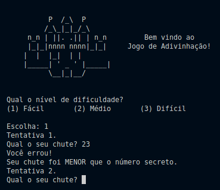
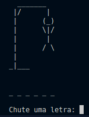
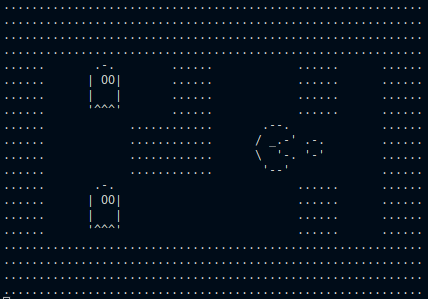

This repository concentrates the projects implemented during the "Formação C" courses at Alura, with all the material and research to help future implementations.

# Documentation:
- [C (linguagem de programação)](https://pt.wikipedia.org/wiki/C_(linguagem_de_programa%C3%A7%C3%A3o))
- [Compiladores Disponíveis](https://pt.wikipedia.org/wiki/Categoria:Compiladores_C)
- [GCC](http://gcc.gnu.org/)

## Compiling C Code with GCC:
```
$ gcc script.c -o script.out
$ ./script.out

```
# Projects:
- Jogo de Adivinhação 
```
$ gcc adivinhacao_v3.c -o adiv3.out
$ ./adiv3.out

```


- Jogo de Forca
```
$ gcc forca_v2.c -o forca2.out
$ ./forca2.out

```


- Jogo do PacMan
```
$ gcc pacman_v2.c mapa.c ui.c -o pacman.out
$ ./pacman.out

```


# Tutorials
- [C (A Linguagem de Programação que é uma MÃE) // Dicionário do Programador](https://www.youtube.com/watch?v=6mUCcsnCn08&t=136s&ab_channel=C%C3%B3digoFonteTV)

# Certificate Alura:
[Formação C](https://cursos.alura.com.br/degree/certificate/3090eee1-d4a9-4b2f-8bfe-4c5c33875a0f)